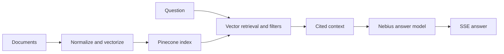

# Retrieval — Domain Knowledge with Pinecone Nexus

Recipe **02 of 7** in the Nebius Cookbook arc:

> Foundation → **Retrieval** → Awareness → Orchestration → Memory → Reliability → Confidence

Cookbook #1 gave you a fluent agent. But fluency isn't knowledge — ask it about
your own product or internal docs and it will guess. Classic RAG patches this
by handing the model raw document chunks at inference time, which burns tokens,
adds latency, and still invites hallucination. This recipe takes a different
route: a **knowledge engine**.

## What you'll build

A FastAPI service that uses [Pinecone Nexus](https://www.pinecone.io/blog/knowledge-infrastructure-for-agents/)
as the agent's knowledge layer. Nexus moves reasoning *upstream — from retrieval
to knowledge compilation* — so the agent queries curated, task-ready knowledge
instead of sifting raw chunks.

At the time this cookbook is being written, **Pinecone Nexus is not yet
generally available**.
That matters for the implementation.
The recipe is framed around the Nexus mental model and architecture, but the
runnable fallback is **standard Pinecone-backed RAG retrieval**: embed your
records on Nebius, store them in Pinecone, retrieve the most relevant context at
request time, and pass that context to the answer model.

So this cookbook should be read in two layers:

1. **Target architecture:** Nexus as the long-term knowledge engine.
2. **Practical implementation today:** classic Pinecone retrieval as the
   production-available substitute.

The three Nexus pieces this recipe leans on:

1. **Context Compiler** — turns a raw data estate into task-specific *knowledge
   artifacts* (one estate, many agents, distinct artifacts per task).
2. **Composable Retriever** — serves those artifacts with low latency, typed
   fields, per-field citations, and confidence scores.
3. **KnowQL** — a declarative query language; the agent expresses *what it
   needs* via six primitives: intent, filter, provenance, output shape,
   confidence, and budget.

## Prerequisites

- Python 3.12+
- [uv](https://docs.astral.sh/uv/)
- A Nebius API key — get one from the [Nebius console](https://nebius.com)
- A Pinecone API key with Nexus access — [pinecone.io](https://www.pinecone.io)

## Planned architecture

```
documents ──► /ingest ──► Nexus Context Compiler ──► knowledge artifacts
                                                            │
question ──► KnowQL query ──► Composable Retriever ──► typed, cited context
                                                            │
                                                            ▼
                                          chat model (Nebius) ──► SSE answer
```

- **Answer model:** `meta-llama/Llama-3.3-70B-Instruct` on Nebius.
- **Embedding model:** `Qwen/Qwen3-Embedding-8B` on Nebius — the vector
  representation behind compilation and KnowQL retrieval. Served from the
  OpenAI-compatible embeddings endpoint, `POST {NEBIUS_BASE_URL}/embeddings`.
- **Knowledge engine:** Pinecone Nexus — compilation, retrieval, and governance
  (PII tagging, versioning, RBAC) happen here, not in app code.

Until Nexus reaches GA, the actual recipe implementation should be understood as
the compatible fallback shape:



The ingest path and the query path are **deliberately separate**. Compilation is
expensive and write-time; querying is cheap and read-time. Splitting them lets
you recompile on a schedule (or a data-change webhook) without coupling it to
request latency.

## Data sources and vectorization

The knowledge layer starts with a **structured data estate**, not an ad hoc pile
of Markdown files.
The current vectorization notes use Goodreads exports as the concrete example,
because they give you enough relational structure to demonstrate how raw records
turn into compiled knowledge.

The expected source files are:

- `goodreads_books.json` or `goodreads_books.json.gz`
- `goodreads_book_authors.json` or `goodreads_book_authors.json.gz`
- `goodreads_book_genres_initial.json` or `goodreads_book_genres_initial.json.gz`

Those files are not treated as three independent corpora.
The pipeline first inspects what is available, then joins books with author
and genre data so each vectorizable unit carries richer domain context
than a single raw row.
Books are prioritized, then enriched with author names and genre labels when
those sources are present.

The vectorization flow is intentionally simple and production-shaped:

1. Analyze the available JSON or gzipped JSON dumps in a data directory.
2. Build the text payload for each record from books, authors, and genres.
3. Generate embeddings with Nebius using `Qwen/Qwen3-Embedding-8B`.
4. Upsert vectors into Pinecone in fixed-size batches.

That split matters.
Embedding is the expensive semantic step, while Pinecone upsert is the indexing
step, so the script exposes separate knobs for each.
For normal ingestion throughput, the practical default is to batch embeddings in
groups of `100` and Pinecone writes in groups of `200`.
That amortizes network overhead on the Nebius side without making Pinecone
upserts unwieldy.

There is also an **analysis-only** mode before you write anything.
That gives you a way to inspect the dataset footprint and confirm the estate is
usable before paying for embeddings or mutating an index.
For partial runs, the pipeline can skip individual source families
(`books`, `authors`, `genres`), keep empty-text records if needed, and
emit periodic progress updates while vectors are being written.

To run the current vectorization script with the cookbook's `uv` environment,
sync dependencies first, then load the required API keys:

```bash
cd cookbooks/02-domain-knowledge-pinecone-nexus
uv sync
cp .env.vectorize.example .env.local
```

`uv` creates the local environment for you.
There is no separate `.venv_vectorize` workflow to maintain or commit.
The script loads `.env.local` or `.env` automatically if present.

For a normal ingestion run, use batched embeddings and batched Pinecone upserts:

```bash
uv run python scripts/vectorize_goodreads_to_pinecone.py \
  --data-dir ../../data \
  --embed-batch-size 100 \
  --embed-concurrency 6 \
  --pinecone-batch-size 200 \
  --progress-interval 1000
```

The script now pipelines those phases instead of running them in strict lockstep.
While one batch is being upserted into Pinecone, the next embedding requests can
already be in flight to Nebius.
For bigger runs, `--embed-concurrency` is the main throughput lever, and
`--max-pending-embed-batches` lets you cap memory and backpressure the pipeline.

If you want a slower, more granular debug mode, you can still force one
embedding request per record with `--embed-batch-size 1`.
That is useful for inspection and troubleshooting, but it is not the right
setting for high-throughput ingestion because it pays the full API round-trip
cost for every single vector.

The point is not Goodreads specifically.
This cookbook pattern is meant to transfer to **your own domain data** too:
product catalogs, support tickets, internal documentation, CRM exports, policy
libraries, or any other structured source you can normalize into records,
compose into text payloads, embed on Nebius, and upsert into Pinecone.
Goodreads is just the example estate used to make the ingestion and
vectorization flow concrete.

## Querying the book RAG

Once the Goodreads book vectors are stored in Pinecone, the query script runs a
simple RAG loop:

1. Embed the user's book request with Nebius.
2. Retrieve matching `book` vectors from Pinecone.
3. Expand around the first matches with related retrieval for the same author,
   same theme, and same publication year.
4. Pass the retrieved book context to the Nebius chat model.
5. Return grounded recommendations with citation markers.

That supports two common reader workflows:

- asking for books on a topic, such as books about Cold War espionage or
  climate fiction
- asking what to read after a book, such as recommendations after *Dune* or
  *The Left Hand of Darkness*

For example:

```bash
uv run python scripts/query_goodreads_pinecone.py \
  "Recommend books about political intrigue and empire-building for someone who liked Dune" \
  --top-k 10 \
  --related-top-k 4 \
  --show-matches
```

By default, retrieval is filtered to `record_type=book`, so author and genre
helper vectors do not leak into the answer set.
The related pass uses metadata from the first retrieved books.
Same-author and same-year retrieval work with the existing book metadata.
Same-theme retrieval uses the `genres` metadata written by the current
vectorizer, so older vectors created before that field was added need to be
upserted again before explicit theme filtering can work.

This is the main retrieval lesson of the cookbook: **vectorization is not just
"chunk and embed."**
The quality of the final knowledge engine depends on source selection, record
joining, text construction, and batching strategy long before the serving path
ever sees a KnowQL query.

## Design decisions

**Why a knowledge engine instead of classic RAG?** RAG's failure mode is
structural: it retrieves *then* reasons, so the model pays — in tokens, latency,
and hallucination risk — to re-derive structure from raw chunks on every call.
Nexus compiles that structure once, write-time, into typed artifacts. The agent
reads a fact with a confidence score; it does not infer a fact from prose.

**Why KnowQL over a raw vector query?** A `top_k` similarity search returns
"things that look like the question." KnowQL lets the agent state *intent*,
*provenance* requirements, an *output shape*, and a *budget* — so retrieval is a
contract, not a guess. It also makes retrieval **auditable**: the query is a
declarative object you can log, diff, and replay.

**Where governance lives.** PII tagging, versioning, and RBAC are Nexus
concerns, not app concerns. Keeping them in the knowledge layer means every
consumer of an artifact inherits the same policy — you cannot accidentally ship
an agent that bypasses redaction by querying differently.

**Trade-off to accept.** A knowledge engine adds a compilation step and a
freshness window: an artifact is only as current as its last compile. For
slowly-changing domain knowledge that is the right trade. For *fast*-changing
facts, that is the wrong tool — which is exactly why Cookbook #3 reaches for
live web search instead.

## Failure modes to design for

| Symptom | Cause | Handling |
|---|---|---|
| Agent answers from stale facts | Data estate changed, artifacts not recompiled | Recompile on a data-change event; surface artifact `compiledAt` in the answer |
| Low-confidence retrieval | The question has no good artifact coverage | Gate on the KnowQL `confidence` primitive; fall back to "I don't have that" rather than guess |
| Conflicting facts | Two sources disagree | Lean on Nexus's deterministic conflict resolution; expose the resolved provenance in citations |
| Cold start — no artifacts | Service deployed before first `/ingest` | `/readyz` should report not-ready until at least one artifact set is compiled |

## Run the FastAPI book recommender

After vectorizing books into Pinecone, run the cookbook backend:

```bash
cd cookbooks/02-domain-knowledge-pinecone-nexus
uv sync
cp .env.example .env
make dev
```

Then call the SSE endpoint:

```bash
curl -N http://localhost:8000/agent/run \
  -H "Content-Type: application/json" \
  -d '{
    "prompt": "Recommend books about political intrigue and empire-building for someone who liked Dune",
    "top_k": 10,
    "related_top_k": 4,
    "include_related": true
  }'
```

The backend emits named SSE events:

```text
event: status
data: {"phase": "sending_to_nebius","message":"Sending to Nebius Token Factory"}

event: status
data: {"phase": "retrieving","message":"Requesting Pinecone Results"}

event: context
data: {"books": [...]}

event: status
data: {"phase": "synthesizing","message":"Synthesizing"}

event: answer
data: {"text": "..."}

event: status
data: {"phase":"done","message":"Done (742 token in | 219 token out | Cost: 0.000000 USD)","usage":{...}}

event: done
data: {"embeddingTokens":31,"inputTokens":742,"outputTokens":219,"totalTokens":992,"costUsd":0.0}
```

The model sees more retrieved candidates than it returns, but the answer is
limited to at most **5 recommended books**.
Cost is estimated from Nebius `GET /v1/models?verbose=true` when the model
catalog exposes pricing fields.
If lookup fails, the app falls back to optional pricing env vars in `.env`:
`NEBIUS_INPUT_PRICE_PER_MILLION_TOKENS`,
`NEBIUS_OUTPUT_PRICE_PER_MILLION_TOKENS`, and
`NEBIUS_EMBEDDING_PRICE_PER_MILLION_TOKENS`.

## Endpoints

| Method | Path          | Purpose                                                  |
| ------ | ------------- | -------------------------------------------------------- |
| POST   | `/agent/run`  | Recommend books from Pinecone-backed Goodreads retrieval, streamed as SSE. |
| GET    | `/healthz`    | Liveness probe.                                          |
| GET    | `/readyz`     | Readiness probe.                                         |

## Status

- [x] `recipe.json` metadata
- [x] Documentation
- [x] `app/` implementation
- [x] Makefile
- [ ] Tests
- [ ] Dockerfile
- [ ] `docs/deployment.md`

## Reference

- Pinecone — [Knowledge infrastructure for agents](https://www.pinecone.io/blog/knowledge-infrastructure-for-agents/)

## Going further

Next in the arc: **[Awareness — Real-Time Data with Tavily](../03-real-time-data-tavily/)** —
once your agent knows your compiled domain knowledge, teach it to reach for
fresh facts on the open web.

## License

MIT
