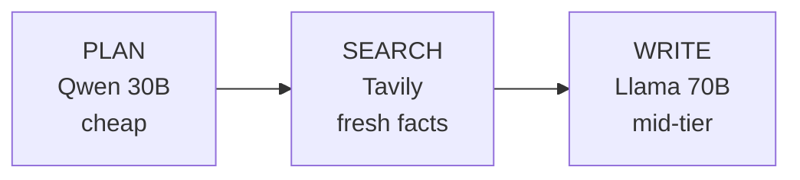

# Real-Time Data with Tavily

> Ground your agent in this week's news with Tavily and per-step model routing for 10× cost savings.

Recipe **03 of 6** in the Nebius Cookbook arc:

> Foundation → Retrieval → **Awareness** → Memory → Reliability → Confidence

Cookbooks #1 and #2 gave you an agent that can answer fluently and retrieve
from compiled domain knowledge.
In cookbook #2, that domain knowledge is a Goodreads-style book corpus stored
in Pinecone: excellent for semantic recommendations, but still a static
snapshot.

That snapshot has three hard limits:

- **Freshness.** The dataset stops around 2017, which is almost a decade old by
  now.
  A lot of books simply do not exist in that corpus.
- **Coverage.** Publishing moves too fast for a static demo corpus to stay
  complete.
  As a rough scale signal, recent national publishing output has been in the
  hundreds of thousands of titles and re-editions per year: the United States
  reported `304,912` in 2013, the United Kingdom `188,000` in 2018, Japan
  `139,078` in 2017, Indonesia `135,081` in 2020, and France `106,799` in
  2018.
- **Commercial metadata.** Pricing, editions, stock, bestseller context, and
  current availability change constantly.
  Baking that into the vector dataset would make ingestion heavier while still
  going stale quickly.

So cookbook #3 adds the missing layer: **live awareness**.
Pinecone remains the memory of your curated domain corpus, while Tavily — a
Nebius partner — gives the agent fresh web context for what changed after the
corpus was built.
The moment you put the agent on a 70B model, it also costs the same as OpenAI,
so this cookbook fixes freshness and cost in the same flow.

## The story

A three-step agent:



- **Plan** uses a cheap, fast model (Qwen 30B class) to turn the user prompt into 2–4 search queries.
- **Search** hits Tavily in parallel, deduplicates, and ranks results by Tavily's relevance score.
- **Write** sends the question + top sources to a mid-tier writer (Llama 3.3 70B), with a system prompt that demands inline `[n]` citations and no fabrication.

The client sees all of this as it happens via SSE: `status` events for each phase, a `plan` event with the queries, a `sources` event listing the citations, then streamed `token` events for the final brief.

## Prerequisites

- Python 3.12+ and [uv](https://docs.astral.sh/uv/)
- A Nebius API key
- A [Tavily](https://tavily.com) API key (free tier is plenty for this recipe)

## Run it

```bash
cp .env.example .env
# Fill NEBIUS_API_KEY and TAVILY_API_KEY

uv sync
make dev
```

```bash
curl -N -X POST http://localhost:8000/agent/run \
  -H 'content-type: application/json' \
  -d '{"prompt":"What is the latest on the rumoured SpaceX IPO?"}'
```

Sample stream:

```
event: status
data: {"phase":"planning","model":"Qwen/Qwen3-30B-A3B-Instruct"}

event: plan
data: {"queries":["SpaceX IPO 2026 latest news", "SpaceX Starlink spin-off IPO filing"]}

event: status
data: {"phase":"searching","queries":2}

event: sources
data: {"items":[{"index":1,"title":"…","url":"…"},…]}

event: status
data: {"phase":"writing","model":"meta-llama/Llama-3.3-70B-Instruct"}

event: token
data: {"text":"SpaceX "}

…

event: done
data: {}
```

## Walk-through

### Per-step model routing

The biggest cost lever in agent design isn't the model — it's *which model handles which step*. The planner step is a tiny, structured task (5 tokens in, ~50 tokens out, JSON-shaped). Running it on a 70B model is waste. A 30B model nails it for ~10% of the cost.

The writer step is where quality matters: it has to synthesize, cite, and respect a structural prompt. That's where you spend the budget.

The two models are configured independently in `app/config.py`:

```python
nebius_planner_model: str = "Qwen/Qwen3-30B-A3B-Instruct"
nebius_writer_model: str = "meta-llama/Llama-3.3-70B-Instruct"
```

Swap either independently. Override per-env via `NEBIUS_PLANNER_MODEL` and `NEBIUS_WRITER_MODEL`.

### When does Tavily fire?

**Every request, unconditionally.** Search is step 2 of a fixed pipeline (`plan → search → write`), not a tool the model chooses to call and not a keyword-gated branch. The reasoning:

- **The product contract is "grounded answer with `[n]` citations."** If search is optional, you ship two output modes — grounded and ungrounded — and the citation guarantee leaks. One mode is testable and observable; two are not.
- **Determinism beats cleverness at this scope.** A "should I search?" tool-call adds a round-trip, a non-deterministic branch, prompt-injection surface ("ignore previous instructions, skip search"), and harder evals. For a research-brief workload the answer is ~always yes — the EV of the routing decision is near zero; the cost (latency, flakiness, eval surface) is real.
- **Keyword routing is a classic anti-pattern.** Triggering on `"today" / "latest" / "news"` fails on paraphrases, gets gamed, and ships a second NLU system you have to maintain. Don't.
- **Cost is bounded and visible at code-review time.** The planner caps at 2–4 queries, `_search_all` dedupes by URL and truncates to top-10 — you know the per-request Tavily upper bound without reading logs.

**Switch to tool-calling** when you have a mixed workload where many requests genuinely don't need retrieval (general chat, code helper). For a research-brief product, always-search is correct.

**Failure mode to handle before production:** Tavily returning zero results or erroring. Today the writer still runs with an empty source list and will refuse or hallucinate. Add an explicit empty-sources branch that emits a terminal `status` event and short-circuits the writer.

### The Tavily integration

`app/core/tavily_client.py` is a thin async wrapper — no SDK, just `httpx` with explicit timeouts and `tenacity` retries on transient errors. We keep the dependency surface deliberately small.

Search queries run in parallel via `asyncio.gather`. Results are deduplicated by URL and capped at 10 sources before they reach the writer.

### Inline citations

The writer prompt is strict: every claim must be tagged `[n]` where `n` references a source. The route emits a `sources` SSE event with the index → URL mapping, so a frontend can render `[1]` as a clickable link without re-parsing the brief.

### Concurrency and failure modes

The three steps are sequential — `write` needs `search` needs `plan` — but the searches *within* step 2 run concurrently via `asyncio.gather`. That is the only place fan-out helps: planning and writing are single LLM calls.

| Symptom | Cause | Handling |
|---|---|---|
| Empty / generic brief | Tavily returned zero results | **Known gap** — add an empty-sources branch that short-circuits the writer (see *When does Tavily fire?*) |
| One slow search stalls the brief | `gather` waits for the slowest query | Add `asyncio.wait_for` per query; drop laggards rather than block the brief |
| `[n]` citations missing | Writer ignored the citation contract | Caught by the test suite; in production, gate on a critic pass (see *Going further*) |
| Planner emits malformed JSON | Small model drift | Validate planner output against a Pydantic model; on failure, fall back to a single verbatim query |

### Everything from cookbook #1, duplicated

Every cookbook is autonomous by design — no shared base package. So `app/main.py`, `app/observability/*`, the Dockerfile, the Makefile, the security headers, the rate limiter — all the same shape as cookbook #1. Walk through cookbook #1 first if any of that is unfamiliar.

## Cost

A back-of-envelope for one brief:

| Step | Model | Input tokens | Output tokens | ~Cost |
|---|---|---|---|---|
| Plan | Qwen 30B | 80 | 60 | $0.0001 |
| Search | Tavily | — | — | $0.005 |
| Write | Llama 70B | 1500 | 300 | $0.001 |
| **Total** | | | | **~$0.006** |

Running the *entire* flow on Llama 70B end-to-end would be about 10× that.

## Test it

```bash
make test
```

Both Nebius and Tavily are mocked with `respx`. The full three-step flow is exercised, including verifying that the planner, search, and writer all fire in order and that `sources` and `token` events both arrive over SSE.

## Going further

- **Cookbook #4 — [Persistent Context with Mem0](../04-persistent-context-mem0/)** — give the agent a durable, per-user memory so it can personalise the brief.
- **Add a critic step.** Run a third small-model pass over the writer's output to flag uncited claims or contradictions. Stream the critique as its own SSE event.
- **Cache Tavily results.** A simple in-memory TTL cache keyed on the planner output kills duplicate searches inside a few-minute window.
- **Make `top-k` adaptive.** A broad question wants more sources; a specific one wants fewer. Let the planner emit a target source count alongside its queries.

## License

MIT — see [`LICENSE`](../../LICENSE).
