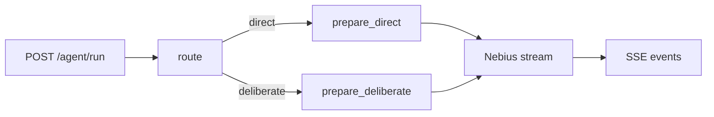

# Orchestration — Stronger Agents with LangChain and LangGraph

> Turn the hand-wired Nebius agent into a typed graph that can choose the shortest useful path to an answer.

Recipe **04 of 10** in the Nebius Cookbook arc:

> Foundation → Retrieval → Grounding → **Orchestration** → Thread Memory → User Memory → Observability → Guardrails → Simulation → Actions

The first three cookbooks prove the Nebius integration path: call the model, ground it in private data, then add fresh web context.
The next production problem is latency.
A working agent can still feel broken when one answer comes back as:

```text
Time: 40.78s | Tokens: 40 embed, 1421 in, 535 out | Cost: $0.000399
```

That cost is fine.
The wait is not.
This cookbook introduces LangChain and LangGraph as the point where orchestration becomes explicit enough to reduce time to response: route the request, skip unnecessary model/tool work, cap generated tokens by path, and stream phase events as soon as the graph has something useful to report.

After moving the book agent into the graph, a follow-up recommendation request with recent-context needs came back like this:

```text
Time: 6.97s | Tokens: 418 in, 266 out | Cost: $0.000161 | Routing: deliberate / curated_plus_fresh_context
```

The important change is not only the lower cost.
It is that the user sees useful output in seconds, while the route and context decision stay visible for debugging.

## What you'll build

A production-shape FastAPI service that keeps the same SSE contract as the earlier recipes, but moves latency-sensitive orchestration into a LangGraph state graph:

1. **Route** — classify the request as `direct` or `deliberate` without spending a model call.
2. **Prepare** — use a LangChain prompt template to build Nebius chat messages from graph state.
3. **Budget** — cap output tokens differently for fast-path and deliberate-path requests.
4. **Stream** — emit named SSE events while graph updates and Nebius tokens arrive.

Persistent context and memory primitives are deliberately saved for Cookbook #5.
This recipe stays focused on graph shape, typed state, and streaming events.



## Prerequisites

- Python 3.12+
- [uv](https://docs.astral.sh/uv/)
- A Nebius API key — get one from the [Nebius console](https://nebius.com)
- Docker (optional)

## Run it

```bash
cp .env.example .env
# Open .env and fill NEBIUS_API_KEY

uv sync
make dev
```

Then in another terminal:

```bash
curl -N -X POST http://localhost:8000/agent/run \
  -H 'content-type: application/json' \
  -d '{"prompt":"Recommend recent climate fiction with enough context to explain why each book is worth reading now."}'
```

You should see named SSE events:

```text
event: status
data: {"phase":"routing","targetFirstTokenMs":1200}

event: status
data: {"phase":"routed","route":"direct"}

event: status
data: {"phase":"writing","route":"direct"}

event: token
data: {"text":"Graph"}

event: done
data: {}
```

## Walk-through

The FastAPI route stays intentionally boring.
It validates the request, passes temperature and max-token controls into the agent, and translates typed events into SSE.
The graph lives in [`app/core/agent.py`](app/core/agent.py).

```text
request ──► route ──► LangGraph route node ──► direct/deliberate prepare node ──► Nebius stream ──► SSE
```

The graph is small on purpose, but the production move is real.
The route node makes the latency decision visible.
The prepare nodes keep prompt construction out of the route handler.
The token budgets make "answer directly" and "think a little more" materially different execution paths.

This is not magic acceleration.
LangGraph does not make a model emit tokens faster.
It helps you stop spending latency on work the current request does not need, and it gives the API layer immediate progress events instead of a silent 40-second wait.

## Latency controls

The default `.env.example` includes:

```bash
DIRECT_RESPONSE_MAX_TOKENS=384
DELIBERATE_RESPONSE_MAX_TOKENS=700
FIRST_TOKEN_TARGET_MS=1200
```

Simple prompts use the direct route and a smaller output budget.
Longer prompts, comparisons, pricing questions, or freshness-sensitive wording use the deliberate route.
The client can still send `temperature` and `max_tokens`, but the graph clamps `max_tokens` to the selected route's budget.

## Why this is faster

The earlier retrieval and real-time examples prove the full production path: embed, retrieve, search, synthesize, then stream.
That path is valuable when the prompt needs domain knowledge or fresh context.
It is wasteful when the user asks a small direct question.

Cookbook #4 separates orchestration from capability.
The graph first decides which work is necessary.
The direct route avoids extra model or tool calls and keeps the answer budget small.
The deliberate route keeps room for a richer answer, but it is still bounded.
Both routes send `status` events before the model finishes, so the user is never waiting on a silent connection.

## Metrics

The `/metrics` endpoint includes the base HTTP and Nebius metrics from the earlier cookbooks, plus orchestration-specific signals:

```text
agent_route_total{route="direct"}
agent_route_total{route="deliberate"}
agent_first_token_seconds_bucket{route="direct",le="1.2"}
```

These metrics answer the production questions this cookbook raises:

- Which path are users actually taking?
- Is the fast path staying fast?
- Did a routing change improve time to first token or just move latency around?

## Memory boundary

This cookbook does not introduce persistent context or memory primitives.
The state graph only carries the data needed for the current request.
Cookbook #5 introduces short-term thread memory, and Cookbook #6 adds durable user/application memory.

## Test it

```bash
uv run pytest
uv run ruff check
uv run ruff format --check
```

The tests mock the Nebius streaming endpoint with `respx`, so they do not call the network by default.

## Going further

- Replace the deterministic route node with a small-model router once the routing policy needs semantics instead of keywords.
- Add a retrieval/tool node between planning and writing.
- Run independent tool calls in parallel once this graph has more than one tool edge.
- Cookbook #5 adds LangGraph memory for thread and user/application context.

## Reference

- LangGraph quickstart — [docs.langchain.com/oss/python/langgraph/quickstart](https://docs.langchain.com/oss/python/langgraph/quickstart)

## License

MIT
